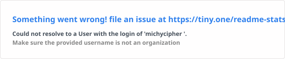
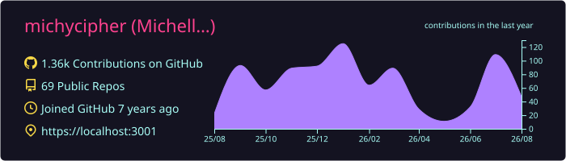
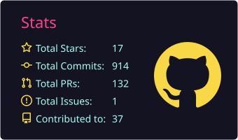

 

  ⚡ I love turning concepts into interactive experiences that make people go <em>“wow!”</em>

---

## 👩‍💻 About Me

Hey, I'm Michelle, a **Mobile & Web Developer** specializing in React Native, React, Vue.js, Next.js, and TypeScript. I build production-ready, user-friendly applications while solving problems one error message at a time.

- 🔭 Building production-ready frontend and full-stack applications with **React, React Native, Next.js, TypeScript, Vue.js**, and modern tooling.
- 🧠 Applying advanced **TypeScript, Redux Toolkit, Pinia, Zod validation**, and performance optimization.
- ⚙️ Shipping **dashboards, admin panels, payment flows, real-time features, mobile applications**, and scalable production UI workflows.
- ⚡ Constantly refining **UX, performance, architecture, and developer experience** through real-world projects and open-source work.

---

## 💼 Professional Skills

With a strong background in **frontend engineering and mobile development**, and a focus on clean, efficient, and maintainable code, I specialize in:

- 🚀 Building scalable, responsive, and user-friendly applications using **React Native, React, Vue.js, Next.js, and Tailwind CSS**
- 💡 Working extensively with **JavaScript, TypeScript, REST APIs, WebSockets**, and modern frontend and backend technologies
- 🔄 Version control and collaboration with **Git, GitHub, CI/CD pipelines**, and agile development workflows
- ⚡ State management using **Redux Toolkit, Zustand, Pinia, and React Query**
- 🔐 Building authenticated application flows, payment interfaces, API integrations, validation systems, and production-ready frontend architecture
- 🧩 Backend development with **Node.js, Express.js, MongoDB, PostgreSQL, Prisma, Supabase**, and related tooling

---

## 🛠 Tools & Technologies

  <!-- JavaScript -->
  

  <!-- TypeScript -->
  

  <!-- Vue -->
  

  <!-- Pinia -->
  

  <!-- React -->
  

  <!-- React Native -->
  

  <!-- Expo -->
  

  <!-- Next.js -->
  

  <!-- Vite -->
  

  <!-- Tailwind -->
  

  <!-- Redux -->
  

  <!-- Node -->
  

  <!-- Express -->
  

  <!-- MongoDB -->
  

  <!-- PostgreSQL -->
  

  <!-- Supabase -->
  

  <!-- Firebase -->
  

  <!-- Prisma -->
  

  <!-- Convex -->
  

  <!-- Figma -->
  

  <!-- Postman -->
  

  <!-- Git -->
  

  <!-- Vercel -->
  

  <!-- Netlify -->
  

---

## 📊 GitHub Stats

<!-- C+ GitHub Rank Card -->

  

 

<!-- Contribution / Activity Graph -->

  

 

<!-- Total Commits 2026 + Most Used Languages -->

  
  &nbsp;&nbsp;
  

 

<!-- GitHub Streak -->

  

 

<!-- Visitor Counter -->

  

  

  

  

  

