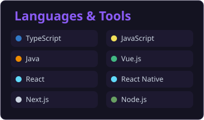

  
  
  
  
  
  
  
  
  
  
  
  
  

---

## 📊 GitHub Stats & Activity Health

  

  <strong>Total Commits (2026) &nbsp; • &nbsp; Languages & Tools &nbsp; • &nbsp; Current-Year Health</strong>

  
  &nbsp;&nbsp;
  

  

  Health grade is automatically recalculated from current-year GitHub activity by GitHub Actions.

  

  

  

  
  
  

